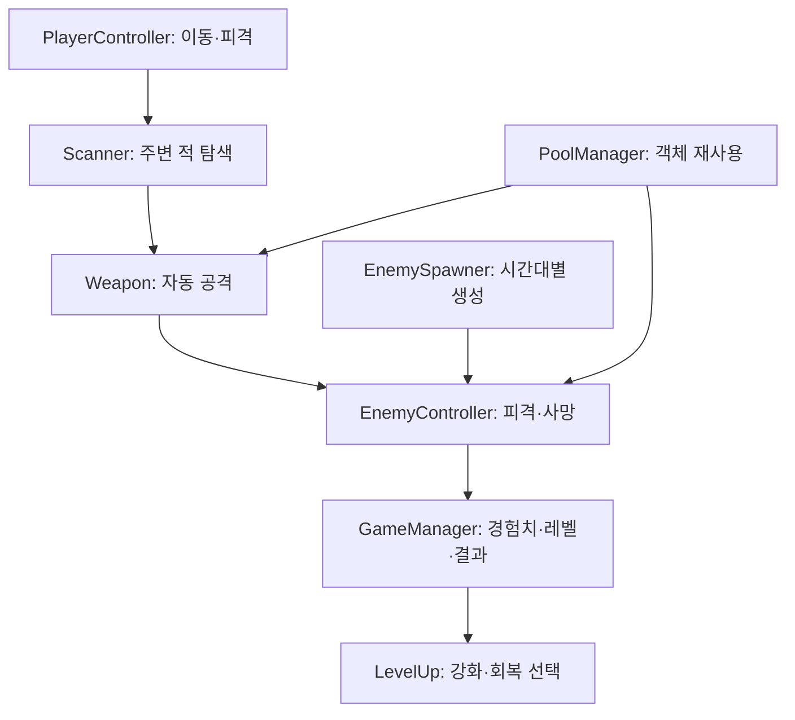

<div align="center">

# AutoAttack Survivor

**자동 공격과 성장 선택을 반복하며 60초 동안 생존하는 2D 액션 게임**


</div>

> 🎮 **게임 플레이 영상:** https://www.youtube.com/watch?v=QfOOeNC8odk

---

## 프로젝트 소개

플레이어가 직접 이동하고, 무기는 주변의 적을 자동으로 탐색해 공격합니다.

적을 처치해 경험치를 얻고 무기 강화 또는 회복 아이템을 선택하며, 점점 강해지는 적을 상대해 제한 시간 동안 생존하는 것이 목표입니다.

| 항목 | 내용 |
| --- | --- |
| 장르 | 2D 탑다운 서바이벌 액션 |
| 개발 형태 | 개인 학습·확장 프로젝트 |
| 개발 환경 | Unity 2022.3 LTS, C# |
| 플랫폼 | Windows PC |
| 플레이 시간 | 1회 60초 |
| 담당 분야 | 게임 로직, 전투, 적 생성, 아이템, UI, 게임 결과 처리 |

---

## 핵심 플레이

1. 플레이어 이동
2. 가장 가까운 적 자동 탐색
3. 근접·원거리 무기를 이용한 자동 공격
4. 적 처치 후 경험치 획득
5. 레벨업 시 무기 강화 또는 체력 회복
6. 시간에 따라 증가하는 적의 능력과 생성 속도
7. 60초 생존 또는 체력 소진에 따른 결과 처리
8. 결과 화면에서 게임 재시작

```text
이동 및 자동 공격
→ 적 처치
→ 경험치 획득
→ 레벨업
→ 무기 강화 또는 회복
→ 60초 생존
```

---

## 주요 구현

### 1. 게임 상태와 60초 플레이 흐름

[`GameManager`](./Assets/Scripts/GameManager.cs)에서 게임의 시작, 진행, 정지, 승리, 패배, 재시작을 관리합니다.

- `isLive`를 이용해 플레이 중에만 시간과 경험치를 갱신
- 제한 시간에 도달하면 남은 적을 정리하고 승리 처리
- 플레이어의 체력이 소진되면 입력과 전투를 중단하고 패배 처리
- 결과 화면에서 메인 씬을 다시 불러와 재시작
- 레벨업 선택 중에는 `Time.timeScale`을 정지하고 선택 후 재개

---

### 2. 자동 탐색과 공격 시스템

[`Scanner`](./Assets/Scripts/Scanner.cs)가 일정 범위 안의 적을 탐색하고 가장 가까운 대상을 선택합니다.

[`Weapon`](./Assets/Scripts/Item/Weapon.cs)은 무기 종류에 따라 공격 방식을 다르게 처리합니다.

- 회전형 근접 무기
- 가장 가까운 적을 향해 발사하는 원거리 무기
- 무기별 공격력과 투사체 개수 적용
- 레벨업 데이터에 따른 공격력과 투사체 수 증가
- 플레이어에게 유효한 타깃이 없으면 원거리 공격을 대기

---

### 3. 시간대별 적 생성과 난이도 조절

`SpawnData`에 다음 정보를 묶어 관리합니다.

- 적 생성 간격
- 적 타입
- 체력
- 이동 속도

[`EnemySpawner`](./Assets/Scripts/Enemy/EnemySpawner.cs)는 경과 시간을 10초 단위로 구분하고, 현재 단계의 `SpawnData`를 생성된 적에게 전달합니다.

| 게임 시간 | 생성 간격 | 체력 | 이동 속도 | 적 타입 |
| --- | ---: | ---: | ---: | ---: |
| 0–10초 | 0.9초 | 10 | 1.5 | 0 |
| 10–20초 | 0.7초 | 14 | 1.9 | 1 |
| 20–30초 | 0.5초 | 18 | 2.3 | 2 |
| 30–60초 | 0.4초 | 24 | 2.7 | 3 |

마지막 단계 이후에는 배열 범위를 벗어나지 않도록 마지막 인덱스를 상한으로 사용했습니다.

---

### 4. 오브젝트 풀링

[`PoolManager`](./Assets/Scripts/PoolManager.cs)를 이용해 적과 투사체를 재사용합니다.

- 풀에 보관된 비활성 오브젝트를 우선 탐색
- 재사용할 객체가 없을 때만 새 오브젝트 생성
- 반복적인 `Instantiate`와 `Destroy` 호출 억제
- 적과 근접·원거리 투사체를 하나의 풀 구조에서 관리

재사용되는 적은 [`EnemyController.Init`](./Assets/Scripts/Enemy/EnemyController.cs)을 통해 현재 단계의 데이터를 다시 적용합니다.

```text
SpawnData
→ EnemySpawner
→ PoolManager.Get()
→ EnemyController.Init(data)
```

---

### 5. 데이터 기반 아이템 시스템

[`ItemData`](./Assets/Scripts/Item/ItemData.cs)를 `ScriptableObject`로 구성했습니다.

각 아이템의 데이터를 코드와 분리해 Unity Inspector에서 관리할 수 있습니다.

- 아이템 이름과 설명
- 아이콘
- 기본 공격력
- 기본 투사체 수
- 레벨별 증가 수치
- 회복량
- 사용할 투사체 프리팹

새 아이템을 추가하거나 수치를 변경할 때 주요 게임 로직을 직접 수정하지 않도록 구성했습니다.

---

### 6. 회복 아이템

회복 포션의 수치를 코드에 직접 입력하지 않고 `ItemData.healAmount`에서 가져옵니다.

- 회복 수치를 아이템 데이터에서 관리
- 현재 체력이 최대 체력을 넘지 않도록 `Mathf.Min` 사용
- 회복 아이템과 무기 강화 로직 분리
- 회복 포션 선택 후에는 무기처럼 레벨이 증가하지 않도록 즉시 반환

---

## 시스템 흐름



---

## 문제 해결

| 문제 | 원인 | 해결 |
| --- | --- | --- |
| 적 생성 시 `IndexOutOfRangeException` 발생 | `SpawnData.spriteType`과 애니메이터 컨트롤러 배열의 인덱스 불일치 | 적 타입과 애니메이터 배열의 구성을 일치시켜 해결 |
| 게임 시간이 늘어나면 스폰 단계가 배열 범위를 벗어날 가능성 | 시간을 기준으로 계산한 단계가 데이터 개수보다 커짐 | `Mathf.Min`으로 마지막 데이터 인덱스를 상한으로 지정 |
| 풀에서 꺼낸 적이 이전 상태를 유지 | 재사용 전에 체력과 동작 상태가 남아 있음 | `OnEnable`에서 공통 상태를 초기화하고 `Init`에서 단계별 능력치를 다시 적용 |
| 회복 수치가 코드에 고정될 가능성 | 아이템 처리 코드가 회복 수치까지 직접 관리 | 회복량을 `ItemData.healAmount`로 분리 |
| 회복 포션을 선택하면 레벨이 증가 | 무기와 소비 아이템이 동일한 후처리 로직을 사용 | 회복 처리 후 즉시 반환해 레벨 증가 로직과 분리 |

---

## AI 활용 및 검증

생성형 AI를 오류 원인 탐색과 코드 구조 검토에 활용했습니다.

AI의 답변을 바로 적용하지 않고 다음 과정으로 검증했습니다.

1. 오류 메시지와 Stack Trace를 통해 발생 위치 확인
2. `SpawnData`와 애니메이터 배열의 실제 인덱스 비교
3. Unity Inspector에서 직렬화된 데이터 확인
4. 수정 후 여러 스폰 단계에서 반복 테스트
5. 회복 아이템 선택 후 체력과 아이템 레벨 변화 확인

최종 코드는 직접 동작을 설명하고 수정할 수 있는 범위에서 적용했습니다.

---

## 폴더 구조

```text
Assets/
├─ Data/                  # ItemData 에셋
├─ Prefabs/               # 적과 무기 프리팹
├─ Scenes/                # 메인 게임 씬
└─ Scripts/
   ├─ Enemy/              # 적 생성·이동·피격
   ├─ Item/               # 무기·투사체·아이템
   ├─ Player/             # 플레이어 입력·이동·피격
   ├─ UI/                 # HUD·레벨업 UI
   ├─ GameManager.cs      # 게임 상태와 진행 흐름
   ├─ PoolManager.cs      # 오브젝트 풀링
   └─ Scanner.cs          # 주변 적 탐색
```
